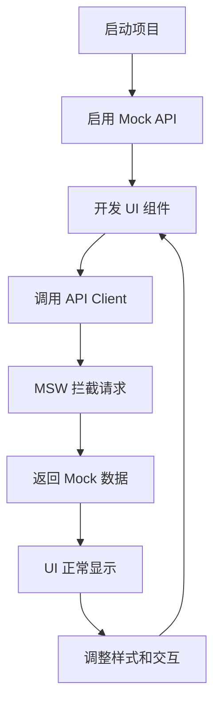
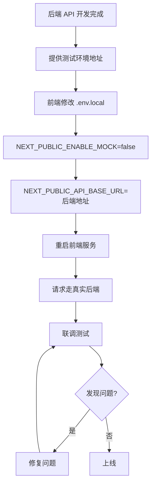

# 前端快速开发指南 - Mock API 模式

> **目标**: 前端/设计师无需后端即可快速开发 UI
> **方案**: 使用 Mock API 拦截网络请求，返回模拟数据
> **优势**: 前端独立开发，后端就绪后无缝切换

---

## 📋 目录

- [方案概述](#方案概述)
- [快速开始](#快速开始)
- [Mock API 配置](#mock-api-配置)
- [切换真实后端](#切换真实后端)
- [开发工作流](#开发工作流)

---

## 方案概述

### 三种 Mock 方案对比

| 方案 | 优势 | 劣势 | 推荐场景 |
|-----|------|------|---------|
| **方案A: MSW (推荐)** | 拦截浏览器请求，真实感强 | 需要配置 Service Worker | 完整前端开发 |
| **方案B: Mock Server** | 独立服务，支持团队共享 | 需要启动额外进程 | 团队协作开发 |
| **方案C: API Switch** | 最简单，代码内切换 | 需要写两套数据逻辑 | 快速原型 |

---

## 快速开始

### 方案 A: MSW (Mock Service Worker) - 推荐 ⭐

**优势**: 拦截浏览器网络请求，前端代码无需修改，后端就绪后只需关闭 Mock

#### 1. 安装依赖

```bash
npm install msw --save-dev
```

#### 2. 初始化 MSW

```bash
npx msw init public/ --save
```

这会在 `public/` 目录创建 `mockServiceWorker.js`

#### 3. 创建 Mock 配置

创建 `src/mocks/handlers.ts`:

```typescript
import { http, HttpResponse } from 'msw';
import type { GetDevicesResponse, Device } from '@/types/api';

// 模拟数据
const mockDevices: Device[] = [
  {
    id: 'device-1',
    name: 'EOS-3A #001',
    model: 'EOS-3A',
    status: 'online',
    ip: '192.168.1.100',
    mac: '00:1A:2B:3C:4D:5E',
    serialNumber: 'EOS3A-2024-001',
    firmwareVersion: '1.2.3',
    lastHeartbeat: Date.now() - 5000,
    capabilities: {
      aiComputing: true,
      videoProcessing: true,
      storage: true,
      networking: true,
    },
    hardware: {
      cpu: 'Intel i7-12700K',
      memory: 32,
      storage: 1024,
      gpu: 'NVIDIA RTX 4060',
    },
    network: {
      type: 'ethernet',
      signalStrength: 95,
      bandwidth: 1000,
    },
    tags: ['生产环境', '高性能'],
    createdAt: Date.now() - 30 * 24 * 60 * 60 * 1000,
    updatedAt: Date.now() - 1000,
  },
  {
    id: 'device-2',
    name: 'EOS-3B #002',
    model: 'EOS-3B',
    status: 'offline',
    ip: '192.168.1.101',
    mac: '00:1A:2B:3C:4D:5F',
    serialNumber: 'EOS3B-2024-002',
    firmwareVersion: '1.2.1',
    lastHeartbeat: Date.now() - 60 * 60 * 1000,
    capabilities: {
      aiComputing: true,
      videoProcessing: false,
      storage: true,
      networking: true,
    },
    hardware: {
      cpu: 'Intel i5-12400',
      memory: 16,
      storage: 512,
    },
    network: {
      type: 'wifi',
      signalStrength: 72,
      bandwidth: 100,
    },
    tags: ['开发环境'],
    createdAt: Date.now() - 20 * 24 * 60 * 60 * 1000,
    updatedAt: Date.now() - 60 * 1000,
  },
];

// API Handlers
export const handlers = [
  // GET /api/devices
  http.get('/api/devices', ({ request }) => {
    const url = new URL(request.url);
    const status = url.searchParams.get('status');

    let devices = mockDevices;

    // 筛选状态
    if (status) {
      devices = devices.filter((d) => d.status === status);
    }

    const response: GetDevicesResponse = {
      devices,
      total: devices.length,
      page: 1,
      pageSize: 20,
    };

    return HttpResponse.json({
      success: true,
      data: response,
      timestamp: Date.now(),
    });
  }),

  // GET /api/devices/:id
  http.get('/api/devices/:id', ({ params }) => {
    const { id } = params;
    const device = mockDevices.find((d) => d.id === id);

    if (!device) {
      return HttpResponse.json(
        {
          success: false,
          error: {
            code: 'NOT_FOUND',
            message: 'Device not found',
          },
          timestamp: Date.now(),
        },
        { status: 404 }
      );
    }

    return HttpResponse.json({
      success: true,
      data: device,
      timestamp: Date.now(),
    });
  }),

  // POST /api/devices
  http.post('/api/devices', async ({ request }) => {
    const body = await request.json();

    const newDevice: Device = {
      id: `device-${Date.now()}`,
      ...body,
      status: 'offline',
      lastHeartbeat: Date.now(),
      createdAt: Date.now(),
      updatedAt: Date.now(),
    };

    mockDevices.push(newDevice);

    return HttpResponse.json(
      {
        success: true,
        data: { device: newDevice },
        timestamp: Date.now(),
      },
      { status: 201 }
    );
  }),

  // DELETE /api/devices/:id
  http.delete('/api/devices/:id', ({ params }) => {
    const { id } = params;
    const index = mockDevices.findIndex((d) => d.id === id);

    if (index === -1) {
      return HttpResponse.json(
        {
          success: false,
          error: {
            code: 'NOT_FOUND',
            message: 'Device not found',
          },
          timestamp: Date.now(),
        },
        { status: 404 }
      );
    }

    mockDevices.splice(index, 1);

    return HttpResponse.json({
      success: true,
      data: null,
      timestamp: Date.now(),
    });
  }),

  // 更多 API handlers...
];
```

#### 4. 创建 MSW 浏览器配置

创建 `src/mocks/browser.ts`:

```typescript
import { setupWorker } from 'msw/browser';
import { handlers } from './handlers';

export const worker = setupWorker(...handlers);
```

#### 5. 在开发环境启用 MSW

修改 `src/app/layout.tsx`:

```tsx
'use client';

import { useEffect } from 'react';

export default function RootLayout({ children }) {
  useEffect(() => {
    // 仅在开发环境且启用 Mock 时启动
    if (
      process.env.NODE_ENV === 'development' &&
      process.env.NEXT_PUBLIC_ENABLE_MOCK === 'true'
    ) {
      import('@/mocks/browser').then(({ worker }) => {
        worker.start({
          onUnhandledRequest: 'bypass', // 不拦截未定义的请求
        });
        console.log('🎭 MSW Mock API 已启用');
      });
    }
  }, []);

  return (
    <html>
      <body>{children}</body>
    </html>
  );
}
```

#### 6. 配置环境变量

在 `.env.local` 中添加:

```bash
# Mock API 开关
NEXT_PUBLIC_ENABLE_MOCK=true

# 后端 API 地址（Mock 模式下不会使用）
NEXT_PUBLIC_API_BASE_URL=http://localhost:8000
```

#### 7. 开始开发！

```bash
npm run dev
```

打开浏览器控制台，你会看到：
```
🎭 MSW Mock API 已启用
```

现在所有对 `/api/*` 的请求都会被 MSW 拦截并返回模拟数据！

---

### 方案 B: JSON Server (独立 Mock 服务器)

**优势**: 独立服务，团队共享，支持持久化

#### 1. 安装依赖

```bash
npm install json-server --save-dev
```

#### 2. 创建 Mock 数据文件

创建 `mocks/db.json`:

```json
{
  "devices": [
    {
      "id": "device-1",
      "name": "EOS-3A #001",
      "model": "EOS-3A",
      "status": "online",
      "ip": "192.168.1.100",
      "mac": "00:1A:2B:3C:4D:5E",
      "serialNumber": "EOS3A-2024-001",
      "firmwareVersion": "1.2.3",
      "lastHeartbeat": 1698765432000,
      "capabilities": {
        "aiComputing": true,
        "videoProcessing": true,
        "storage": true,
        "networking": true
      },
      "hardware": {
        "cpu": "Intel i7-12700K",
        "memory": 32,
        "storage": 1024,
        "gpu": "NVIDIA RTX 4060"
      },
      "network": {
        "type": "ethernet",
        "signalStrength": 95,
        "bandwidth": 1000
      },
      "tags": ["生产环境", "高性能"],
      "createdAt": 1696173432000,
      "updatedAt": 1698764432000
    }
  ],
  "projects": [],
  "avatars": []
}
```

#### 3. 添加 NPM 脚本

在 `package.json` 中添加:

```json
{
  "scripts": {
    "mock:server": "json-server mocks/db.json --port 8000 --watch"
  }
}
```

#### 4. 启动 Mock 服务器

```bash
npm run mock:server
```

服务器会运行在 `http://localhost:8000`

#### 5. 配置环境变量

```bash
# .env.local
NEXT_PUBLIC_API_BASE_URL=http://localhost:8000
NEXT_PUBLIC_ENABLE_MOCK=false  # 不使用 MSW
```

#### 6. 使用 API Client

前端代码无需修改，直接使用:

```typescript
import { api } from '@/lib/api/client';

const devices = await api.devices.list(); // 自动请求 http://localhost:8000/devices
```

---

### 方案 C: 代码内 Mock (最简单)

**优势**: 无需额外配置，快速原型

修改 `src/lib/api/client.ts`:

```typescript
// 在文件顶部添加
const USE_MOCK = process.env.NEXT_PUBLIC_ENABLE_MOCK === 'true';

// 修改 ApiClient 类
export class ApiClient {
  async getDevices(query?: GetDevicesQuery): Promise<GetDevicesResponse> {
    // Mock 数据
    if (USE_MOCK) {
      await delay(500); // 模拟网络延迟
      return {
        devices: MOCK_DEVICES, // 从 mock 文件导入
        total: MOCK_DEVICES.length,
        page: 1,
        pageSize: 20,
      };
    }

    // 真实 API 调用
    return this.request<GetDevicesResponse>('GET', '/devices', { query });
  }
}

// 辅助函数
const delay = (ms: number) => new Promise((resolve) => setTimeout(resolve, ms));
```

---

## Mock API 配置

### 完整的 Mock Handlers 示例

创建 `src/mocks/handlers/index.ts`:

```typescript
import { deviceHandlers } from './devices';
import { fileHandlers } from './files';
import { projectHandlers } from './projects';
import { avatarHandlers } from './avatars';
import { subscriptionHandlers } from './subscriptions';

export const handlers = [
  ...deviceHandlers,
  ...fileHandlers,
  ...projectHandlers,
  ...avatarHandlers,
  ...subscriptionHandlers,
];
```

### 设备 Mock Handlers

创建 `src/mocks/handlers/devices.ts`:

```typescript
import { http, HttpResponse, delay } from 'msw';
import { mockDevices } from '../data/devices';
import type { GetDevicesResponse, Device } from '@/types/api';

export const deviceHandlers = [
  // GET /api/devices - 列表
  http.get('/api/devices', async ({ request }) => {
    await delay(300); // 模拟网络延迟

    const url = new URL(request.url);
    const status = url.searchParams.get('status');
    const model = url.searchParams.get('model');
    const page = parseInt(url.searchParams.get('page') || '1');
    const pageSize = parseInt(url.searchParams.get('pageSize') || '20');

    let devices = [...mockDevices];

    // 筛选
    if (status) {
      devices = devices.filter((d) => d.status === status);
    }
    if (model) {
      devices = devices.filter((d) => d.model === model);
    }

    // 分页
    const start = (page - 1) * pageSize;
    const end = start + pageSize;
    const paginatedDevices = devices.slice(start, end);

    const response: GetDevicesResponse = {
      devices: paginatedDevices,
      total: devices.length,
      page,
      pageSize,
    };

    return HttpResponse.json({
      success: true,
      data: response,
      timestamp: Date.now(),
    });
  }),

  // GET /api/devices/:id - 详情
  http.get('/api/devices/:id', async ({ params }) => {
    await delay(200);

    const { id } = params;
    const device = mockDevices.find((d) => d.id === id);

    if (!device) {
      return HttpResponse.json(
        {
          success: false,
          error: {
            code: 'NOT_FOUND',
            message: `Device ${id} not found`,
          },
          timestamp: Date.now(),
        },
        { status: 404 }
      );
    }

    return HttpResponse.json({
      success: true,
      data: device,
      timestamp: Date.now(),
    });
  }),

  // POST /api/devices - 创建
  http.post('/api/devices', async ({ request }) => {
    await delay(500);

    const body: any = await request.json();

    const newDevice: Device = {
      id: `device-${Date.now()}`,
      name: body.name,
      model: body.model,
      status: 'offline',
      ip: body.ip || '',
      mac: body.mac,
      serialNumber: body.serialNumber,
      firmwareVersion: '1.0.0',
      lastHeartbeat: Date.now(),
      capabilities: {
        aiComputing: false,
        videoProcessing: false,
        storage: false,
        networking: false,
      },
      hardware: {
        cpu: 'Unknown',
        memory: 0,
        storage: 0,
      },
      network: {
        type: 'ethernet',
      },
      location: body.location,
      tags: body.tags || [],
      createdAt: Date.now(),
      updatedAt: Date.now(),
    };

    mockDevices.push(newDevice);

    return HttpResponse.json(
      {
        success: true,
        data: { device: newDevice },
        timestamp: Date.now(),
      },
      { status: 201 }
    );
  }),

  // PUT /api/devices/:id - 更新
  http.put('/api/devices/:id', async ({ params, request }) => {
    await delay(400);

    const { id } = params;
    const body: any = await request.json();
    const index = mockDevices.findIndex((d) => d.id === id);

    if (index === -1) {
      return HttpResponse.json(
        {
          success: false,
          error: {
            code: 'NOT_FOUND',
            message: `Device ${id} not found`,
          },
          timestamp: Date.now(),
        },
        { status: 404 }
      );
    }

    mockDevices[index] = {
      ...mockDevices[index],
      ...body,
      updatedAt: Date.now(),
    };

    return HttpResponse.json({
      success: true,
      data: mockDevices[index],
      timestamp: Date.now(),
    });
  }),

  // DELETE /api/devices/:id - 删除
  http.delete('/api/devices/:id', async ({ params }) => {
    await delay(300);

    const { id } = params;
    const index = mockDevices.findIndex((d) => d.id === id);

    if (index === -1) {
      return HttpResponse.json(
        {
          success: false,
          error: {
            code: 'NOT_FOUND',
            message: `Device ${id} not found`,
          },
          timestamp: Date.now(),
        },
        { status: 404 }
      );
    }

    mockDevices.splice(index, 1);

    return HttpResponse.json({
      success: true,
      data: null,
      timestamp: Date.now(),
    });
  }),
];
```

### Mock 数据生成器

创建 `src/mocks/data/devices.ts`:

```typescript
import type { Device } from '@/types/api';

export const mockDevices: Device[] = [
  {
    id: 'device-1',
    name: 'EOS-3A #001',
    model: 'EOS-3A',
    status: 'online',
    ip: '192.168.1.100',
    mac: '00:1A:2B:3C:4D:5E',
    serialNumber: 'EOS3A-2024-001',
    firmwareVersion: '1.2.3',
    lastHeartbeat: Date.now() - 5000,
    capabilities: {
      aiComputing: true,
      videoProcessing: true,
      storage: true,
      networking: true,
    },
    hardware: {
      cpu: 'Intel i7-12700K',
      memory: 32,
      storage: 1024,
      gpu: 'NVIDIA RTX 4060',
    },
    network: {
      type: 'ethernet',
      signalStrength: 95,
      bandwidth: 1000,
    },
    tags: ['生产环境', '高性能'],
    createdAt: Date.now() - 30 * 24 * 60 * 60 * 1000,
    updatedAt: Date.now() - 1000,
  },
  // 添加更多设备...
];

// 生成随机设备
export function generateMockDevices(count: number): Device[] {
  const devices: Device[] = [];
  const models: ('EOS-3A' | 'EOS-3B' | 'EOS-3C')[] = ['EOS-3A', 'EOS-3B', 'EOS-3C'];
  const statuses: any[] = ['online', 'offline', 'error', 'updating'];

  for (let i = 0; i < count; i++) {
    devices.push({
      id: `device-${i + 1}`,
      name: `${models[i % 3]} #${String(i + 1).padStart(3, '0')}`,
      model: models[i % 3],
      status: statuses[Math.floor(Math.random() * statuses.length)],
      ip: `192.168.1.${100 + i}`,
      mac: `00:1A:2B:3C:4D:${(i + 90).toString(16).toUpperCase()}`,
      serialNumber: `EOS3${String.fromCharCode(65 + (i % 3))}-2024-${String(i + 1).padStart(3, '0')}`,
      firmwareVersion: `1.${Math.floor(Math.random() * 5)}.${Math.floor(Math.random() * 10)}`,
      lastHeartbeat: Date.now() - Math.random() * 60 * 60 * 1000,
      capabilities: {
        aiComputing: Math.random() > 0.3,
        videoProcessing: Math.random() > 0.5,
        storage: true,
        networking: true,
      },
      hardware: {
        cpu: ['Intel i7-12700K', 'Intel i5-12400', 'AMD Ryzen 7 5800X'][i % 3],
        memory: [16, 32, 64][i % 3],
        storage: [512, 1024, 2048][i % 3],
        gpu: i % 2 === 0 ? 'NVIDIA RTX 4060' : undefined,
      },
      network: {
        type: i % 2 === 0 ? 'ethernet' : 'wifi',
        signalStrength: 60 + Math.floor(Math.random() * 40),
        bandwidth: [100, 1000][i % 2],
      },
      tags: i % 3 === 0 ? ['生产环境'] : ['开发环境'],
      createdAt: Date.now() - Math.random() * 90 * 24 * 60 * 60 * 1000,
      updatedAt: Date.now() - Math.random() * 24 * 60 * 60 * 1000,
    });
  }

  return devices;
}
```

---

## 切换真实后端

### 一键切换

只需修改环境变量：

```bash
# .env.local

# 使用 Mock API
NEXT_PUBLIC_ENABLE_MOCK=true

# 切换到真实后端（后端开发完成后）
NEXT_PUBLIC_ENABLE_MOCK=false
NEXT_PUBLIC_API_BASE_URL=https://api.karma.ai
```

重启开发服务器：

```bash
npm run dev
```

**无需修改任何业务代码！**

---

## 开发工作流

### 前端/设计师工作流



### 后端就绪后的切换流程



---

## 最佳实践

### 1. Mock 数据要真实

**❌ 不好的 Mock**:
```typescript
const mockDevice = {
  id: '1',
  name: 'Test Device',
  status: 'online',
};
```

**✅ 好的 Mock**:
```typescript
const mockDevice = {
  id: 'device-550e8400-e29b-41d4-a716-446655440000',
  name: 'EOS-3A 生产服务器 #001',
  model: 'EOS-3A',
  status: 'online',
  firmwareVersion: '1.2.3',
  lastHeartbeat: Date.now() - 5000,
  // 完整的数据结构...
};
```

### 2. 模拟网络延迟

```typescript
http.get('/api/devices', async () => {
  await delay(300); // 300ms 延迟
  return HttpResponse.json(data);
});
```

### 3. 模拟错误场景

```typescript
// 偶尔返回 500 错误
http.post('/api/devices', async () => {
  if (Math.random() < 0.1) { // 10% 概率失败
    return HttpResponse.json(
      { error: 'Internal Server Error' },
      { status: 500 }
    );
  }
  return HttpResponse.json(data);
});
```

### 4. 使用环境变量控制

```typescript
// 开发环境：使用 Mock
// 预发布环境：使用测试后端
// 生产环境：使用生产后端

const API_URL = process.env.NEXT_PUBLIC_API_BASE_URL;
const USE_MOCK = process.env.NEXT_PUBLIC_ENABLE_MOCK === 'true';
```

---

## 总结

| 阶段 | Mock 状态 | 配置 |
|-----|----------|------|
| **前端独立开发** | ✅ 启用 | `NEXT_PUBLIC_ENABLE_MOCK=true` |
| **前后端联调** | ❌ 关闭 | `NEXT_PUBLIC_ENABLE_MOCK=false` |
| **生产部署** | ❌ 关闭 | `NEXT_PUBLIC_API_BASE_URL=https://api.karma.ai` |

**核心优势**:
- ✅ 前端无需等待后端
- ✅ 业务代码无需修改
- ✅ 一键切换真实后端
- ✅ 支持团队协作

---

## 下一步

1. 选择 Mock 方案（推荐 MSW）
2. 创建 Mock Handlers
3. 生成 Mock 数据
4. 开始 UI 开发
5. 后端就绪后切换

🎉 现在前端和设计师可以完全独立开发了！
